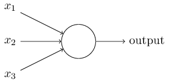
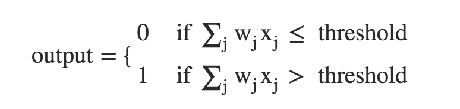
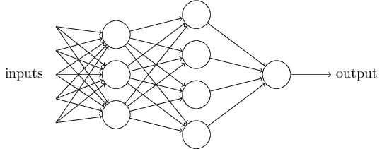
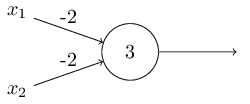

# Usar redes neuronales para el reconocimiento de números escritos a mano

El sistema visual humano es una de las maravillas del mundo. Considera la siguiente secuencia de dígitos escritos a mano:

La mayoría de la gente reconoce sin esfuerzo como esos dígitos 504192. Esa facilidad es engañosa. En cada hemisferio del cerebro, los seres humanos tienen una corteza visual primaria, también conocida como V1, que contiene 140 millones de neuronas, con decenas de miles de millones de conexiones entre ellas. Y sin embargo, la visión humana implica no sólo V1, sino toda una serie de cortezas visuales - V2, V3, V4, V5 y - haciendo un procesamiento de imágenes cada vez más complejo. Llevamos en nuestras cabezas un superordenador, puesto a punto por evolución a lo largo de cientos de millones de años, y muy bien adaptado para comprender el mundo visual. Reconocer los dígitos escritos a mano no es fácil. Por el contrario, los seres humanos lo hacen estupendamente, sorprendentemente buenos para dotar de sentido lo que nos muestran nuestros ojos. Sin embargo, casi todo el trabajo se realiza de manera inconsciente. Y por eso, normalmente no apreciamos lo duro que es el problema a resolver por nuestros sistemas visuales.

La dificultad de reconocimiento de patrones visuales se hace evidente si se intenta escribir un programa de ordenador para reconocer dígitos como los anteriores. Lo que parece fácil cuando lo hacemos a nosotros mismos de repente se vuelve extremadamente difícil. Intuiciones simples sobre cómo reconocemos formas - "un 9 tiene un lazo en la parte superior, y una carrera vertical en la parte inferior derecha" - no son tan simple de expresar de forma algorítmica. Al intentar hacer tales reglas precisas, rápidamente se pierden en un laberinto de excepciones, salvedades y casos especiales. Parece que no hay esperanza.

Las redes neuronales se acercan al problema de una manera diferente. La idea es tomar un gran número de dígitos escritos a mano, conocido como ejemplos de entrenamiento,

y luego desarrollar un sistema que pueda aprender de esos ejemplos de entrenamiento. En otras palabras, la red neuronal utiliza los ejemplos para inferir automáticamente reglas para el reconocimiento de dígitos escritos a mano. Por otra parte, al aumentar el número de ejemplos de entrenamiento, la red puede aprender más acerca de la escritura, y así mejorar su precisión. Así, aunque sólo he mostrado 100 dígitos de entrenamiento, tal vez podríamos mejorar el reconocimiento de escritura mediante el uso de miles o incluso millones o miles de millones de ejemplos.

En este capítulo vamos a escribir un programa de ordenador que implementa una red neuronal que aprende a reconocer los dígitos escritos a mano. El programa está a sólo 74 líneas de largo, y no utiliza las bibliotecas especializadas de redes neuronales. Pero este programa corto puede reconocer dígitos con una precisión más del 96 por ciento, sin intervención humana. Por otra parte, en los capítulos siguientes vamos a desarrollar ideas que puedan mejorar la precisión de más del 99 por ciento. De hecho, las mejores redes neuronales comerciales son ahora tan buenos que son utilizados por los bancos para procesar cheques, y las oficinas de correos para reconocer direcciones.

En este capítulo vamos a escribir un programa de ordenador que implementa una red neuronal que aprende a reconocer los dígitos escritos a mano. El programa tiene tan sólo 74 líneas de largo, y no utiliza ninguna biblioteca especializada de redes neuronales. Pero este corto programa puede reconocer dígitos con una precisión más del 96 por ciento, sin intervención humana. Por otra parte, en los capítulos siguientes vamos a desarrollar ideas que pueden mejorar la precisión hasta un 99 por ciento. De hecho, las mejores redes neuronales comerciales son ahora tan buenas que son utilizadas por los bancos para procesar cheques, y las oficinas de correos para reconocer direcciones.

Nos estamos centrando en el reconocimiento de escritura porque es un excelente problema para el aprendizaje de las redes neuronales en general. Como problema toca varios puntos importantes: es un reto - no es poca cosa reconocer los dígitos escritos a mano - pero no es tan difícil como para requerir una solución muy complicada, o de un enorme poder computacional. Por otra parte, es una gran manera de desarrollar técnicas más avanzadas, tales como el aprendizaje profundo. Y así durante todo el libro vamos a regresar varias veces a este problema de reconocimiento de escritura. Más adelante, discutiremos cómo estas ideas pueden aplicarse a otros problemas a la visión por ordenador, y también al habla, al procesamiento de lenguaje natural y a otros dominios.

Por supuesto, si el punto del capítulo fuera sólo escribir un programa de ordenador para reconocer los dígitos escritos a mano el capítulo sería mucho más corto! Pero en el camino vamos a desarrollar muchas ideas clave sobre las redes neuronales, incluyendo dos tipos importantes de la neurona artificial (el perceptrón y la neurona sigmoide) y el algoritmo de aprendizaje estándar para redes neuronales, conocidos como descenso de gradiente estocástico. En todo momento, me centro en explicar por qué se hacen las cosas como se hacen, y en la construcción de una intuación sobre redes neuronales. Eso necesita una discusión más larga que si yo simplemente presentase la mecánica básica de lo que está pasando, pero creo que merece la pena para alcanzar una comprensión más profunda. Entre los beneficios, al final del capítulo estaremos en condiciones de comprender lo que es el aprendizaje profundo, y por qué es importante.

## Perceptrones

¿Qué es una red neuronal? Para empezar, voy a explicar un tipo de neurona artificial llamado un perceptrón. Los perceptrones [fueron desarrollados](http://books.google.ca/books/about/Principles_of_neurodynamics.html?id=7FhRAAAAMAAJ) en los años 1950 y 1960 por el científico [Frank Rosenblatt](http://es.wikipedia.org/wiki/Frank_Rosenblatt), inspirado en [un trabajo anterior](http://scholar.google.ca/scholar?cluster=4035975255085082870) de [Warren McCulloch](http://es.wikipedia.org/wiki/Warren_McCulloch) y [Walter Pitts](http://es.wikipedia.org/wiki/Walter_Pitts). Hoy en día, es más común el uso de otros modelos de neuronas artificiales - en este libro, y en gran parte obra moderna en redes neuronales, el modelo de neurona principal utilizado es uno llamado la neurona sigmoide. Llegaremos a las neuronas sigmoides en breve. Sin embargo, para entender por qué las neuronas sigmoideas se definen de la forma en que son, vale la pena tomarse el tiempo para entender primero perceptrones.

Entonces, ¿cómo funcionan los perceptrones? Un perceptrón toma varias entradas binarias, `x1, x2, ...`, y produce una sola salida binaria:

En el ejemplo mostrado, el perceptrón tiene tres entradas: `x1, x2, x3`. En general, se podría tener más o menos entradas. Rosenblatt propuso una regla simple para calcular la salida. Introdujo pesos (`w1, w2...`) también números reales que expresan la importancia relativa de las respectivas entradas. La salida de la neurona, 0 o 1, se determina calculando la suma ponderada y comprobando que sea menor o mayor que un cierto valor umbral. Al igual que los pesos, el umbral es un número real y es un parámetro de la neurona. Para ponerlo en términos algebraicos más precisos:

Eso es todo lo que que saber sobre el funcionamiento de un perceptrón!

Ese es el modelo matemático básico. Una manera en que se puede pensar en el perceptrón es que es un dispositivo que toma decisiones sopesando una evidencia. Déjame darte un ejemplo. No es un ejemplo muy realista, pero es fácil de entender, y pronto llegaremos a ejemplos más realistas. Supongamos que el fin de semana se acerca, y has oído que va a haber un festival de queso en tu ciudad. Te gusta el queso, y estás tratando de decidir si debes ir o no a la fiesta. Es posible que su decisión se base en tres factores:

- ¿El clima es agradable?
- ¿Tu novio o novia quiere acompañarte?
- ¿Se puede llegar en transporte público? (No tienes coche)

Podemos representar estos tres factores por los correspondientes variables binarias `x1, x2, x3`. Por ejemplo, tendríamos que `x1 = 1` si el tiempo es bueno, y `x1 = 0` si el tiempo es malo. Del mismo modo, `x2 = 1` si tu novio o novia quiere ir, y `x2 = 0` en caso contrario. Repetimos de igual manera usando `x3` y el transporte público.

Ahora, supongamos que adoras absolutamente queso, tanto es así que estás dispuesto a ir a la fiesta incluso si tu novio o novia no está interesado/a y es difícil llegar al festival. Pero tal vez realmente odias el mal tiempo, y no hay manera de que vayas a la fiesta si el tiempo es malo. Puedes usar perceptrones para modelar este tipo de toma de decisiones. Una forma de hacer esto es elegir un peso w1 = 6 para el clima, y w2 = 2 y w3 = 2 para las otras condiciones. El valor más grande de w1 indica que el tiempo te importa mucho, mucho más que si tu novio o novia te acompaña, o la cercanía del transporte público. Por último, supongamos que eliges un umbral de 55 para el perceptrón. Con estas opciones, el perceptrón implementa el modelo de toma de decisiones deseado, obteniendo 1 cuando el tiempo es bueno, y 0 cada vez que el tiempo es malo. No hay ninguna diferencia en la salida si tienes o no compañía o si el transporte público está cerca o lejos.

Mediante la variación de los pesos y el umbral, podemos obtener diferentes modelos de toma de decisiones. Por ejemplo, supongamos que en vez elegimos un umbral de 33. A continuación, el perceptrón decidiría que hay que ir a la fiesta cuando el tiempo es bueno o cuando tanto el festival estaba cerca de transporte público y su novio o novia estaba dispuesto/a a acompañarte. En otras palabras, sería un modelo diferente de toma de decisiones. Bajar el umbral significa que estás más dispuesto a ir al festival.

Obviamente, el perceptrón no es un modelo completo de la toma de decisiones humana! Pero lo que el ejemplo ilustra es cómo un perceptrón puede sopesar diferentes tipos de evidencias con el fin de tomar decisiones. Y debe parecer plausible que una red más compleja de perceptrones podría tomar decisiones más sutiles:

En esta red, la primera columna de perceptrones - lo que llamaremos la primera _capa_ de perceptrones - está tomando tres decisiones muy simples mediante la ponderación de las pruebas de entrada. ¿Qué pasa con los perceptrones en la segunda capa? Cada uno de los perceptrones está tomando una decisión ponderando los resultados de la primera capa. De esta manera un perceptrón en la segunda capa puede tomar una decisión en un nivel más complejo y más abstracto que perceptrones en la primera capa. Y decisiones aún más complejos pueden ser tomadas por los perceptrónes en la tercera capa. De esta manera, una red con varias capas de perceptrones puede participar en sofisticadas tomas de decisiones.

Por cierto, cuando he definido perceptrones he dicho que un perceptrón tiene sólo una única salida. En la red de arriba los perceptrones parecen tener múltiples salidas. En realidad siguen teniendo una sola salida. Las flechas de salida múltiples son simplemente una forma útil de indicar que la salida de un perceptrón se utiliza como la entrada a varios  perceptrones. Es más fácil que dibujar una línea de salida única que luego se divida.

Vamos a simplificar la forma en que describimos perceptrones. La condición `∑wx > threshold` es engorrosa, y podemos hacer dos cambios en la notación para simplificarla. El primer cambio es escribir el sumatorio como un producto escalar, `w⋅x ≡ Σwx`, donde `w` y `x` son vectores cuyos componentes son los pesos y las entradas respectivamente. El segundo cambio es pasar el umbral hacia el otro lado de la ecuación, y sustituirlo por lo que se conoce como `sesgo` del perceptrón (NdT: en castellano parece que se usa "umbral" para bias. Aquí utilizaré sesgo para diferenciarlo). Usando el sesgo en lugar de el umbral, la regla de perceptrón se puede reescribir:

Se puede pensar en el sesgo como una medida de lo fácil que es conseguir que el perceptrón de una salida de 1. O, para decirlo en términos más biológicos, el sesgo es una medida de lo fácil que es conseguir que el perceptrón se encienda. Para un perceptrón con un sesgo muy grande, es extremadamente fácil sacar un 1. Pero si el sesgo es muy negativo, entonces es difícil que el perceptrón saque un 1. Es evidente que, introducir el sesgo es sólo un pequeño cambio en la forma de describir los perceptrones, pero ya veremos más adelante que conduce a una simplificación aún mayor de notación. Debido a esto, en el resto del libro no utilizaremos el umbral sino el sesgo.

He descrito perceptrones como un método para la valoración de pruebas para tomar decisiones. Otra forma de usar los perceptrones es para calcular las funciones lógicas elementales que tomamos como subyacentes a la computación, funciones como AND, OR, y NAND. Por ejemplo, supongamos que tenemos un perceptrón con dos entradas, cada una con un peso `-2`, y un sesgo general de `3`. Aquí está nuestra perceptrón:

Entonces vemos que de entrada `[0, 0]` produce la salida `1`, ya que `(-2) * 0 + (- 2) * 0 + 3 = 3` es positivo. Aquí, he introducido el símbolo `*` para realizar las multiplicaciones explícita. Cálculos similares muestran que las entradas `[0, 1]`y `[1, 0]` producen siempre `1`. Sin embargo, la entrada `[1, 1]` produce la salida `0`, ya que `(-2) * 1 + (- 2) * 1 + 3 = -1` es negativo. Así nuestro perceptrón implementa una [puerta NAND](https://es.wikipedia.org/wiki/Puerta_NAND)!
