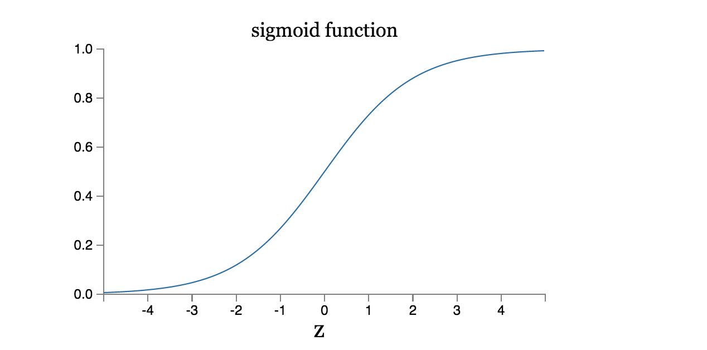

# Usar redes neuronales para el reconocimiento de números escritos a mano

El sistema visual humano es una de las maravillas del mundo. Considera la siguiente secuencia de dígitos escritos a mano:

La mayoría de la gente reconoce sin esfuerzo como esos dígitos 504192. Esa facilidad es engañosa. En cada hemisferio del cerebro, los seres humanos tienen una corteza visual primaria, también conocida como V1, que contiene 140 millones de neuronas, con decenas de miles de millones de conexiones entre ellas. Y sin embargo, la visión humana implica no sólo V1, sino toda una serie de cortezas visuales - V2, V3, V4, V5 y - haciendo un procesamiento de imágenes cada vez más complejo. Llevamos en nuestras cabezas un superordenador, puesto a punto por evolución a lo largo de cientos de millones de años, y muy bien adaptado para comprender el mundo visual. Reconocer los dígitos escritos a mano no es fácil. Por el contrario, los seres humanos lo hacen estupendamente, sorprendentemente buenos para dotar de sentido lo que nos muestran nuestros ojos. Sin embargo, casi todo el trabajo se realiza de manera inconsciente. Y por eso, normalmente no apreciamos lo duro que es el problema a resolver por nuestros sistemas visuales.

La dificultad de reconocimiento de patrones visuales se hace evidente si se intenta escribir un programa de ordenador para reconocer dígitos como los anteriores. Lo que parece fácil cuando lo hacemos a nosotros mismos de repente se vuelve extremadamente difícil. Intuiciones simples sobre cómo reconocemos formas - "un 9 tiene un lazo en la parte superior, y una carrera vertical en la parte inferior derecha" - no son tan simple de expresar de forma algorítmica. Al intentar hacer tales reglas precisas, rápidamente se pierden en un laberinto de excepciones, salvedades y casos especiales. Parece que no hay esperanza.

Las redes neuronales se acercan al problema de una manera diferente. La idea es tomar un gran número de dígitos escritos a mano, conocido como ejemplos de entrenamiento,

y luego desarrollar un sistema que pueda aprender de esos ejemplos de entrenamiento. En otras palabras, la red neuronal utiliza los ejemplos para inferir automáticamente reglas para el reconocimiento de dígitos escritos a mano. Por otra parte, al aumentar el número de ejemplos de entrenamiento, la red puede aprender más acerca de la escritura, y así mejorar su precisión. Así, aunque sólo he mostrado 100 dígitos de entrenamiento, tal vez podríamos mejorar el reconocimiento de escritura mediante el uso de miles o incluso millones o miles de millones de ejemplos.

En este capítulo vamos a escribir un programa de ordenador que implementa una red neuronal que aprende a reconocer los dígitos escritos a mano. El programa está a sólo 74 líneas de largo, y no utiliza las bibliotecas especializadas de redes neuronales. Pero este programa corto puede reconocer dígitos con una precisión más del 96 por ciento, sin intervención humana. Por otra parte, en los capítulos siguientes vamos a desarrollar ideas que puedan mejorar la precisión de más del 99 por ciento. De hecho, las mejores redes neuronales comerciales son ahora tan buenos que son utilizados por los bancos para procesar cheques, y las oficinas de correos para reconocer direcciones.

En este capítulo vamos a escribir un programa de ordenador que implementa una red neuronal que aprende a reconocer los dígitos escritos a mano. El programa tiene tan sólo 74 líneas de largo, y no utiliza ninguna biblioteca especializada de redes neuronales. Pero este corto programa puede reconocer dígitos con una precisión más del 96 por ciento, sin intervención humana. Por otra parte, en los capítulos siguientes vamos a desarrollar ideas que pueden mejorar la precisión hasta un 99 por ciento. De hecho, las mejores redes neuronales comerciales son ahora tan buenas que son utilizadas por los bancos para procesar cheques, y las oficinas de correos para reconocer direcciones.

Nos estamos centrando en el reconocimiento de escritura porque es un excelente problema para el aprendizaje de las redes neuronales en general. Como problema toca varios puntos importantes: es un reto - no es poca cosa reconocer los dígitos escritos a mano - pero no es tan difícil como para requerir una solución muy complicada, o de un enorme poder computacional. Por otra parte, es una gran manera de desarrollar técnicas más avanzadas, tales como el aprendizaje profundo. Y así durante todo el libro vamos a regresar varias veces a este problema de reconocimiento de escritura. Más adelante, discutiremos cómo estas ideas pueden aplicarse a otros problemas a la visión por ordenador, y también al habla, al procesamiento de lenguaje natural y a otros dominios.

Por supuesto, si el punto del capítulo fuera sólo escribir un programa de ordenador para reconocer los dígitos escritos a mano el capítulo sería mucho más corto! Pero en el camino vamos a desarrollar muchas ideas clave sobre las redes neuronales, incluyendo dos tipos importantes de la neurona artificial (el perceptrón y la neurona sigmoide) y el algoritmo de aprendizaje estándar para redes neuronales, conocidos como descenso de gradiente estocástico. En todo momento, me centro en explicar por qué se hacen las cosas como se hacen, y en la construcción de una intuación sobre redes neuronales. Eso necesita una discusión más larga que si yo simplemente presentase la mecánica básica de lo que está pasando, pero creo que merece la pena para alcanzar una comprensión más profunda. Entre los beneficios, al final del capítulo estaremos en condiciones de comprender lo que es el aprendizaje profundo, y por qué es importante.

## Perceptrones

¿Qué es una red neuronal? Para empezar, voy a explicar un tipo de neurona artificial llamado un perceptrón. Los perceptrones [fueron desarrollados](http://books.google.ca/books/about/Principles_of_neurodynamics.html?id=7FhRAAAAMAAJ) en los años 1950 y 1960 por el científico [Frank Rosenblatt](http://es.wikipedia.org/wiki/Frank_Rosenblatt), inspirado en [un trabajo anterior](http://scholar.google.ca/scholar?cluster=4035975255085082870) de [Warren McCulloch](http://es.wikipedia.org/wiki/Warren_McCulloch) y [Walter Pitts](http://es.wikipedia.org/wiki/Walter_Pitts). Hoy en día, es más común el uso de otros modelos de neuronas artificiales - en este libro, y en gran parte obra moderna en redes neuronales, el modelo de neurona principal utilizado es uno llamado la neurona sigmoide. Llegaremos a las neuronas sigmoides en breve. Sin embargo, para entender por qué las neuronas sigmoideas se definen de la forma en que son, vale la pena tomarse el tiempo para entender primero perceptrones.

Entonces, ¿cómo funcionan los perceptrones? Un perceptrón toma varias entradas binarias, `x1, x2, ...`, y produce una sola salida binaria:

En el ejemplo mostrado, el perceptrón tiene tres entradas: `x1, x2, x3`. En general, se podría tener más o menos entradas. Rosenblatt propuso una regla simple para calcular la salida. Introdujo pesos (`w1, w2...`) también números reales que expresan la importancia relativa de las respectivas entradas. La salida de la neurona, 0 o 1, se determina calculando la suma ponderada y comprobando que sea menor o mayor que un cierto valor umbral. Al igual que los pesos, el umbral es un número real y es un parámetro de la neurona. Para ponerlo en términos algebraicos más precisos:

Eso es todo lo que que saber sobre el funcionamiento de un perceptrón!

Ese es el modelo matemático básico. Una manera en que se puede pensar en el perceptrón es que es un dispositivo que toma decisiones sopesando una evidencia. Déjame darte un ejemplo. No es un ejemplo muy realista, pero es fácil de entender, y pronto llegaremos a ejemplos más realistas. Supongamos que el fin de semana se acerca, y has oído que va a haber un festival de queso en tu ciudad. Te gusta el queso, y estás tratando de decidir si debes ir o no a la fiesta. Es posible que su decisión se base en tres factores:

- ¿El clima es agradable?
- ¿Tu novio o novia quiere acompañarte?
- ¿Se puede llegar en transporte público? (No tienes coche)

Podemos representar estos tres factores por los correspondientes variables binarias `x1, x2, x3`. Por ejemplo, tendríamos que `x1 = 1` si el tiempo es bueno, y `x1 = 0` si el tiempo es malo. Del mismo modo, `x2 = 1` si tu novio o novia quiere ir, y `x2 = 0` en caso contrario. Repetimos de igual manera usando `x3` y el transporte público.

Ahora, supongamos que adoras absolutamente queso, tanto es así que estás dispuesto a ir a la fiesta incluso si tu novio o novia no está interesado/a y es difícil llegar al festival. Pero tal vez realmente odias el mal tiempo, y no hay manera de que vayas a la fiesta si el tiempo es malo. Puedes usar perceptrones para modelar este tipo de toma de decisiones. Una forma de hacer esto es elegir un peso w1 = 6 para el clima, y w2 = 2 y w3 = 2 para las otras condiciones. El valor más grande de w1 indica que el tiempo te importa mucho, mucho más que si tu novio o novia te acompaña, o la cercanía del transporte público. Por último, supongamos que eliges un umbral de 55 para el perceptrón. Con estas opciones, el perceptrón implementa el modelo de toma de decisiones deseado, obteniendo 1 cuando el tiempo es bueno, y 0 cada vez que el tiempo es malo. No hay ninguna diferencia en la salida si tienes o no compañía o si el transporte público está cerca o lejos.

Mediante la variación de los pesos y el umbral, podemos obtener diferentes modelos de toma de decisiones. Por ejemplo, supongamos que en vez elegimos un umbral de 33. A continuación, el perceptrón decidiría que hay que ir a la fiesta cuando el tiempo es bueno o cuando tanto el festival estaba cerca de transporte público y su novio o novia estaba dispuesto/a a acompañarte. En otras palabras, sería un modelo diferente de toma de decisiones. Bajar el umbral significa que estás más dispuesto a ir al festival.

Obviamente, el perceptrón no es un modelo completo de la toma de decisiones humana! Pero lo que el ejemplo ilustra es cómo un perceptrón puede sopesar diferentes tipos de evidencias con el fin de tomar decisiones. Y debe parecer plausible que una red más compleja de perceptrones podría tomar decisiones más sutiles:

En esta red, la primera columna de perceptrones - lo que llamaremos la primera _capa_ de perceptrones - está tomando tres decisiones muy simples mediante la ponderación de las pruebas de entrada. ¿Qué pasa con los perceptrones en la segunda capa? Cada uno de los perceptrones está tomando una decisión ponderando los resultados de la primera capa. De esta manera un perceptrón en la segunda capa puede tomar una decisión en un nivel más complejo y más abstracto que perceptrones en la primera capa. Y decisiones aún más complejos pueden ser tomadas por los perceptrónes en la tercera capa. De esta manera, una red con varias capas de perceptrones puede participar en sofisticadas tomas de decisiones.

Por cierto, cuando he definido perceptrones he dicho que un perceptrón tiene sólo una única salida. En la red de arriba los perceptrones parecen tener múltiples salidas. En realidad siguen teniendo una sola salida. Las flechas de salida múltiples son simplemente una forma útil de indicar que la salida de un perceptrón se utiliza como la entrada a varios  perceptrones. Es más fácil que dibujar una línea de salida única que luego se divida.

Vamos a simplificar la forma en que describimos perceptrones. La condición `∑wx > threshold` es engorrosa, y podemos hacer dos cambios en la notación para simplificarla. El primer cambio es escribir el sumatorio como un producto escalar, `w⋅x ≡ Σwx`, donde `w` y `x` son vectores cuyos componentes son los pesos y las entradas respectivamente. El segundo cambio es pasar el umbral hacia el otro lado de la ecuación, y sustituirlo por lo que se conoce como `sesgo` del perceptrón (NdT: en castellano parece que se usa "umbral" para bias. Aquí utilizaré sesgo para diferenciarlo). Usando el sesgo en lugar de el umbral, la regla de perceptrón se puede reescribir:

Se puede pensar en el sesgo como una medida de lo fácil que es conseguir que el perceptrón de una salida de 1. O, para decirlo en términos más biológicos, el sesgo es una medida de lo fácil que es conseguir que el perceptrón se encienda. Para un perceptrón con un sesgo muy grande, es extremadamente fácil sacar un 1. Pero si el sesgo es muy negativo, entonces es difícil que el perceptrón saque un 1. Es evidente que, introducir el sesgo es sólo un pequeño cambio en la forma de describir los perceptrones, pero ya veremos más adelante que conduce a una simplificación aún mayor de notación. Debido a esto, en el resto del libro no utilizaremos el umbral sino el sesgo.

He descrito perceptrones como un método para la valoración de pruebas para tomar decisiones. Otra forma de usar los perceptrones es para calcular las funciones lógicas elementales que tomamos como subyacentes a la computación, funciones como AND, OR, y NAND. Por ejemplo, supongamos que tenemos un perceptrón con dos entradas, cada una con un peso `-2`, y un sesgo general de `3`. Aquí está nuestra perceptrón:

Entonces vemos que de entrada `[0, 0]` produce la salida `1`, ya que `(-2) * 0 + (- 2) * 0 + 3 = 3` es positivo. Aquí, he introducido el símbolo `*` para realizar las multiplicaciones explícita. Cálculos similares muestran que las entradas `[0, 1]`y `[1, 0]` producen siempre `1`. Sin embargo, la entrada `[1, 1]` produce la salida `0`, ya que `(-2) * 1 + (- 2) * 1 + 3 = -1` es negativo. Así nuestro perceptrón implementa una [puerta NAND](https://es.wikipedia.org/wiki/Puerta_NAND)!

El ejemplo NAND demuestra que se pueden utilizar perceptrones para calcular funciones lógicas simples. De hecho, podemos utilizar redes de perceptrones para calcular cualquier función lógica. La razón es que la puerta NAND es universal para el cálculo computacional, es decir, podemos construir cualquier cálculo a base de puertas NAND. Por ejemplo, podemos utilizar compuertas NAND para construir un circuito que suma dos bits, `x1` y `x2`. Esto requiere el cálculo de la suma bit a bit, `x1⊕x2`, así como un bit de acarreo que se establece en `1` cuando ambos `x1` y `x2` son `1`, es decir, el bit de acarreo es el producto `x1x2` bit a bit:

Para tener una red equivalente de perceptrones reemplazamos todas las puertas NAND por perceptrones con dos entradas, cada una con un peso `[-2, -2]`, y un sesgo general de `3`. Aquí está la red resultante. Ten en cuenta que me he movido el perceptrón correspondiente a la puerta NAND de la parte inferior derecha un poco simplemente para simplificar las flechas en el diagrama:

Un aspecto importante de esta red de perceptrones es que la salida del  perceptron más a la izquierda se utiliza dos veces como entrada para el perceptrón inferior. Cuando he definido el modelo de perceptrón no he dicho si se le permitía este tipo de salida-doble-al-mismo-lugar. En realidad, no importa mucho. Si no queremos permitir que este tipo de cosas, entonces es posible simplemente fusionar las dos líneas, en una sola conexión con un peso de -4 en lugar de dos conexiones con pesos de -2 (si no encuentras esto obvio, debes parar hasta probar que es equivalente) Con este cambio, la red se ve de la siguiente forma, con todos los pesos sin marcar igual a -2, todos los sesgos igual a 3, y una solo peso de -4, como está indicado:

Up to now I've been drawing inputs like x1x1 and x2x2 as variables floating to the left of the network of perceptrons. In fact, it's conventional to draw an extra layer of perceptrons - the input layer - to encode the inputs:

Esta notación para los perceptrones de entrada, en los que tenemos una salida, pero no hay entradas,

es una abreviatura. En realidad, no significa un perceptrón sin entradas. Para entenderlo, supongamos que tenemos un perceptrón sin entradas. A continuación, la suma ponderada siempre sería cero, y por lo tanto el perceptrón sacaría siempre `1` si el sesgo es mayor que 0, o `0` si el sesgo es menor o igual que 0. Es decir, el perceptrón simplemente sacaría un valor fijo y no el valor deseado (`x1`, en el ejemplo anterior). Es mejor pensar que los perceptrones de entrada no son perceptrones en absoluto, sino más bien unidades especiales que simplemente se definen como que sacan a los valores deseados `x1, x2, ...`

El ejemplo del sumador demuestra cómo una red de perceptrones se puede utilizar para simular un circuito que contiene muchas puertas NAND. Y debido a puertas NAND son universales para el cálculo computacional, se deduce que los perceptrones también son universales para el mismo cálculo.

La universalidad computacional de los perceptrones es a la vez tranquilizador y decepcionante. Es tranquilizador porque nos dice que las redes de perceptrones pueden ser tan poderosas como cualquier otro dispositivo informático. Pero también es decepcionante, ya que hace que parezca como si perceptrones no son más que un nuevo tipo de puerta NAND. ¡Y eso no es una gran noticia!

However, the situation is better than this view suggests. It turns out that we can devise learning algorithms which can automatically tune the weights and biases of a network of artificial neurons. This tuning happens in response to external stimuli, without direct intervention by a programmer. These learning algorithms enable us to use artificial neurons in a way which is radically different to conventional logic gates. Instead of explicitly laying out a circuit of NAND and other gates, our neural networks can simply learn to solve problems, sometimes problems where it would be extremely difficult to directly design a conventional circuit.

## Neuronas sigmoides

Algoritmos de aprendizaje suena fenomenal. Pero ¿cómo podemos diseñar este tipo de algoritmos para una red neuronal? Supongamos que tenemos una red de perceptrones que nos gustaría utilizar para aprender a resolver algún problema. Por ejemplo, las entradas a la red podrían ser los datos de píxeles en bruto a partir de un escaneado, la imagen escrita a mano de un dígito. Y nos gustaría que la red para aprenda pesos y sesgos de modo que la salida de la red clasifique correctamente el dígito. Para ver cómo el aprendizaje podría funcionar, supongamos que hacemos un pequeño cambio en un cierto peso (o sesgo) en la red. Lo que nos gustaría es que este pequeño cambio en el peso cause sólo un pequeño cambio correspondiente en la salida de la red. Como veremos en un momento, esta propiedad hará posible el aprendizaje. Esquemáticamente, esto es lo que queremos (obviamente esta red es demasiado simple para hacer el reconocimiento de escritura!):

Si fuera cierto que un pequeño cambio en un peso (o sesgo) hace que se produzca sólo un pequeño cambio en la salida, entonces podríamos utilizar este hecho para modificar los pesos y sesgos y conseguir que nuestra red se comporte más parecido a como queremos. Por ejemplo, supongamos que la red se clasifique erróneamente una imagen como un "8" cuando debería ser un "9". Podemos averiguar cómo hacer un pequeño cambio en los pesos y sesgos lo que la red se acerque un poco más a la clasificación de la imagen como un "9". Y luego nos repetimos esto, cambiando los pesos y sesgos una y otra vez, para producir una respuesta más acertada. Así, la red estaría aprendiendo.

El problema es que esto no es lo que sucede cuando nuestra red contiene perceptrones. De hecho, un pequeño cambio en los pesos o sesgo de un solo perceptron en la red a veces puede causar que la salida de ese perceptrón se voltee completamente, por ejemplo de 00 a 11. Ese cambio puede hacer que el comportamiento del resto de la red cambie completamente de maneras muy complejas. Así, mientras que el "9" puede ahora ser clasificado correctamente, el comportamiento de la red en todas las otras imágenes es probable que haya cambiado completamente de alguna manera difícil de controlar. Eso hace que sea difícil ver cómo modificar gradualmente los pesos y sesgos para que la red se aproxime al comportamiento deseado. Tal vez haya alguna forma inteligente de solucionar este problema. Pero no es inmediatamente obvio cómo podemos conseguir una red de perceptrones aprenda.

We can overcome this problem by introducing a new type of artificial neuron called a sigmoid neuron. Sigmoid neurons are similar to perceptrons, but modified so that small changes in their weights and bias cause only a small change in their output. That's the crucial fact which will allow a network of sigmoid neurons to learn.

Bien, déjame describir la neurona sigmoide. Vamos a representar las neuronas sigmoides de la misma forma en que se representan los perceptrones:

Al igual que un perceptrón, la neurona sigmoide tiene entradas, `x1, x2, ...`. Pero en lugar de ser sólo `0` o `1`, estas entradas también se pueden tomar en cualquier valor entre 0 y 1. Así, por ejemplo, `0.638` es una entrada válida para una neurona sigmoide. También al igual que un perceptrón, la neurona sigmoide tiene pesos para cada entrada, `w1, w2, ...` y un sesgo general, `b`. Pero la salida no es binaria. En cambio, es `σ(w⋅x + b)`, donde `σ` se llama función sigmoide. Por cierto, `σ` a veces se llama la función logística, y esto hace que las neuronas se llamen neuronas logísticas. Es útil recordar esta terminología, ya que estos términos son utilizados por muchas personas que trabajan con redes neuronales. Sin embargo, yo me quedo con la terminología sigmoide que se define por:

Para ponerlo todo un poco más explícito, la salida de una neurona sigmoide con entradas `x1, x2, ...`, pesos `w1, w2, ...` y `b` sesgo es

A primera vista, las neuronas sigmoide parecen muy diferentes a los perceptrones. La forma algebraica de la función sigmoide puede parecer opaca e inaccesible si no está familiarizado con ella. De hecho, hay muchas similitudes entre los perceptrones y neuronas sigmoide, y la forma algebraica de la función sigmoide resulta ser más un detalle técnico que una verdadera barrera para la comprensión.

Para entender la similitud con el modelo de perceptrón, supongamos z≡w⋅x + bz≡w⋅x + b es un número positivo grande. Entonces  z≈0e-z≈0 y así σ (z) ≈1σ (z) ≈1. En otras palabras, cuando z = w⋅x + bz = w⋅x + b es grande y positivo, la salida de la neurona sigmoide es de aproximadamente 11, tal como lo habría sido para un perceptrón. Supongamos que por otra parte que z = w⋅x + bz = w⋅x + b es muy negativo. A continuación, e-z → ∞e-z → ∞, y σ (z) ≈0σ (z) ≈0. Así que cuando z = w⋅x + bz = w⋅x + b es muy negativo, el comportamiento de una neurona sigmoide también se aproxima mucho a un perceptrón. Es sólo cuando w⋅x + bw⋅x + b es de tamaño modesto que hay mucha desviación del modelo de perceptrón.

¿Qué pasa con la forma algebraica de σ? ¿Cómo podemos entender eso? De hecho, la forma exacta de σ no es tan importante - lo que realmente importa es la forma de la función cuando ésta se representa. Aquí está la forma:

Esta forma es una versión suavizada de una función escalonada:

Si σ hubiera sido en realidad una función escalón, entonces la neurona sigmoide sería un perceptrón, ya que la salida sería 1 o 0 dependiendo de si w⋅x + b + bw⋅x fuese positivo o negativo (En realidad, cuando w⋅ x + b = 0 el perceptrón da 0, mientras que las función de paso da 1. Por lo tanto, en sentido estricto, necesitamos modificar la función escalonada en solo ese punto. Pero se entiende la idea). Mediante el uso de la función σ tenemos, como se ha visto anteriormente, un perceptrón suavizado. De hecho, la suavidad de la función σ es un hecho crucial, no un detalle. La suavidad de σ significa que pequeños cambios ΔwjΔwj en los pesos y ΔbΔb en el sesgo producirán un pequeño cambio ΔoutputΔoutput en la salida de la neurona. De hecho, el cálculo nos dice que ΔoutputΔoutput se aproxima a

donde la suma es sobre todos los pesos, wj, y ∂output / ∂wj y ∂output / ∂b∂output / ∂B denotan derivadas parciales de la outputoutput con respecto a wjwj y bb, respectivamente. ¡No te asustes si no estás muy cómodo/a con derivadas parciales! Mientras que la expresión anterior parece complicado, con todas las derivadas parciales, en realidad está diciendo algo muy simple (lo cual es una muy buena noticia): ΔoutputΔoutput es una función lineal de los cambios ΔwjΔwj y ΔbΔb en los pesos y sesgos. Esta linealidad hace que sea fácil elegir los pequeños cambios en los pesos y sesgos para lograr cualquier pequeño cambio deseado en la salida. Así, mientras que las neuronas sigmoide tienen casi el mismo comportamiento cualitativo que los perceptrones, hacen que sea mucho más fácil averiguar cómo el cambio de los pesos y sesgos cambiará la salida.

Si se trata de la forma de σσ la que realmente importa, y no su forma exacta, entonces ¿por qué utilizar la forma particular de σσ en la ecuación (3)? De hecho, más tarde en el libro de vez en cuando vamos a considerar las neuronas donde la salida es f (w⋅x + b) usando otra función de activación f (⋅). Lo principal que cambia cuando se utiliza una función de activación diferente es que los valores particulares para las derivadas parciales de la ecuación (5) cambian. Resulta que cuando calculamos las derivadas parciales después, usando σσ simplificará el álgebra, simplemente porque exponenciales tienen propiedades preciosas cuando se derivan. En cualquier caso, σσ se utilizada normalmente en los trabajos sobre redes neuronales, y es la función de activación vamos a utilizar con mayor frecuencia en este libro.

¿Cómo debemos interpretar la salida de una neurona sigmoide? Obviamente, una gran diferencia entre los perceptrones y neuronas sigmoide es que las neuronas sigmoides no se limitan a la salida binaria. Pueden tener como salida cualquier número real entre 0 y 1, así como los valores 0.173 y 0.689 también son salidas legítimas. Esto puede ser útil, por ejemplo, si queremos utilizar el valor de salida para representar la intensidad media de los píxeles de una imagen de entrada a una red neuronal. Pero a veces puede ser una molestia. Supongamos que queremos la salida de la red, ya sea para indicar "la imagen de entrada es un 9" o "la imagen de entrada no es un 9". Obviamente, sería más fácil de hacer esto si la salida fue un 0 o un 1, como en un perceptrón. Pero en la práctica, podemos establecer una convención para hacer frente a esto, por ejemplo, con la decisión de interpretar cualquier salida de al menos 0.50.5 como indicadores de un "9", y cualquier salida inferior a 0.50.5 como una indicación de "no es un 9 ". Siempre voy a indicar explícitamente cuando estamos utilizando una convención de ese tipo, por lo que no debería causar ninguna confusión.

## Ejercicios

- **Neuronas sigmoides que simulan perceptrones, parte I**: Supongamos que tomamos todos los pesos y sesgos en una red de perceptrones, y se multiplican por una constante positiva, c > 0. Demuestra que el comportamiento de la red no cambia.
- **Neuronas sigmoides que simulan perceptrones, parte II**: Supongamos que tenemos la misma configuración que el último problema - una red de perceptrones. Supongamos también que la entrada general a la red de perceptrones ha sido elegido. No necesitaremos el valor real de entrada, sólo tenemos la entrada que se ha fijado. Supongamos que los pesos y sesgos son tales que w⋅x + b + b ≠ 0w⋅x ≠ 0 para la entrada xx a cualquier perceptrón trate de la red. Ahora remplaza todos los perceptrones en la red por las neuronas sigmoide, y multiplica los pesos y sesgos por una constante positiva c> 0 c> 0. Demuestra que en el límite, cuando c → ∞c → ∞ el comportamiento de esta red de neuronas sigmoideas es exactamente la misma que la red de perceptrones. ¿Cómo puede fallar cuando w⋅x + b = 0w⋅x + b = 0 para uno de los perceptrones?

## La arquitectura de una red neuronal

En la siguiente sección voy a introducir una red neuronal que puede hacer un buen trabajo clasificando los dígitos escritos a mano. En preparación para eso, ayuda explicar algunos de los términos que nos permiten nombrar diferentes partes de una red. Supongamos que tenemos la red:

Como se mencionó anteriormente, la capa más a la izquierda en esta red se llama la capa de entrada, y las neuronas en la capa se llaman neuronas de entrada. La capa más a la derecha o de salida contiene las neuronas de salida, o, como en este caso, una única neurona de salida. La capa media se llama una capa oculta, ya que las neuronas en esta capa son ni entradas ni salidas. El término "oculta" quizá suena un poco misteriosa - la primera vez que oí el término pensé que debe tener un profundo significado filosófico o matemático - pero realmente no significa nada más que "no es una entrada o una salida". La red anteriormente tiene una sola capa oculta, pero algunas redes tienen múltiples capas ocultas. Por ejemplo, la siguiente red de cuatro capas tiene dos capas ocultas:

De forma un tanto confusa, y por razones históricas, tales redes de capas múltiples se denominan a veces perceptrones multicapa o MLP, a pesar de estar formado por neuronas sigmoides, no perceptrones. No voy  usar la terminología MLP en este libro, ya que creo que es confuso, pero quería advertir de su existencia.

El diseño de las capas de entrada y de salida en una red es a menudo sencillo. Por ejemplo, supongamos que estamos tratando de determinar si una imagen manuscrita representa un "9" o no. Una forma natural de diseñar la red es codificar las intensidades de los píxeles de la imagen en las neuronas de entrada. Si la imagen es una imagen en escala de grises 6464 por 6464, entonces tendríamos 4.096 = 64 × 644,096 neuronas = 64 × 64 de entrada, con las intensidades de la escala apropiada entre 00 y 11. La capa de salida contendrá sólo una sola neurona, con la salida valores inferiores a 0.50.5 indicando de "imagen de entrada no es un 9", y valores superiores a 0.50.5 que indica "imagen de entrada es un 9".

Si bien el diseño de las capas de entrada y de salida de una red neuronal es a menudo sencillo, puede haber todo un arte en el diseño de las capas ocultas. En particular, no es posible resumir el proceso de diseño de las capas ocultas con algunas reglas simples. En cambio, las personas que trabajan con redes neuronales han desarrollado muchas heurísticas de diseño para las capas ocultas, que ayudan a la gente a que se consigua el comportamiento deseado en su redes. Por ejemplo, este tipo de heurística se pueden utilizar para ayudar a determinar cómo determinar el número de capas ocultas en función de el tiempo necesario para entrenar a la red. Nos encontraremos varias de estas heurísticas de diseño más adelante en este libro.

Hasta ahora, hemos estado discutiendo redes neuronales donde se utiliza la salida de una capa como entrada a la siguiente capa. Este tipo de redes se denominan redes neuronales feedforward. Esto significa que no hay bucles en la red - la información siempre se alimenta hacia adelante, nunca se realimenta. Si permitiésemos bucles, nos gustaría impedir situaciones en las que la entrada a la función σσ dependa de la salida. Eso no tendría mucho sentido, por lo que no se permiten este tipo de bucles.

Sin embargo, hay otros modelos de redes neuronales artificiales en las que son posibles bucles de retroalimentación. Estos modelos se llaman redes neuronales recurrentes. La idea de estos modelos es disponer de neuronas que se encienden durante una cierta cantidad de tiempo limitado, antes de volver al reposo. Esta activación puede estimular otras neuronas, que también pueden dispararse un poco más tarde, también por un tiempo limitado. Eso hace que aún más neuronas se enciendan, por lo que con el tiempo se obtiene una cascada de neuronas encendidas. Los bucles no causan problemas en un modelo de este tipo, ya que la salida de una neurona sólo afecta a su entrada en algún momento posterior, no instantáneamente.

Las redes neuronales recurrentes han tenido menos peso que las redes de alimentación hacia adelante, en parte debido a que los algoritmos de aprendizaje para redes recurrentes son (al menos hasta la fecha) menos potentes. Pero las redes recurrentes siguen siendo extremadamente interesantes. Están mucho más cerca en espíritu a cómo funciona nuestro cerebro que las redes de alimentación hacia adelante. Y es posible que redes recurrentes pueden resolver los problemas importantes que sólo pueden ser resueltos con gran dificultad las redes de alimentación hacia adelante. Sin embargo, para limitar nuestro campo de acción, en este libro vamos a concentrarnos en las redes de alimentación hacia adelante, que son más ampliamente utilizadas.

## Una red simple para clasificar números escritos a mano

Habiendo definido las redes neuronales, volvamos al reconocimiento de escritura. Podemos dividir el problema del reconocimiento de dígitos escritos a mano en dos sub-problemas. En primer lugar, tenemos que dividir una imagen con varios dígitos en una secuencia de imágenes independientes, cada uno con un solo dígito. Por ejemplo, nos gustaría dividir la imagen

en seis imágenes separadas,

We humans solve this segmentation problem with ease, but it's challenging for a computer program to correctly break up the image. Once the image has been segmented, the program then needs to classify each individual digit. So, for instance, we'd like our program to recognize that the first digit above,

es un 5.

Nos centraremos en escribir un programa que resuelva el segundo problema, es decir, la clasificación de los dígitos individuales. Hacemos esto porque resulta que el problema de la segmentación no es tan difícil de resolver una vez que tenga una buena forma de clasificar los dígitos individuales. Hay muchos enfoques para resolver el problema de la segmentación. Un método consiste probar muchas maneras diferentes de segmentar la imagen, utilizando el clasificador individual de dígitos para puntuar cada segmentación. Una segmentación concreta obtiene una puntuación alta si el clasificador de dígitos consigue distinguir cada uno de los segmentos, y una puntuación baja si el clasificador tiene problemas en uno o más segmentos. La idea es que si el clasificador tiene problemas en algún lugar, entonces es probable que esos problemas sean debidos a que la segmentación ha sido incorrecta. Esta idea y otras variaciones se pueden utilizar para resolver el problema de la segmentación bastante bien. Así que en lugar de preocuparse por la segmentación nos concentraremos en el desarrollo de una red neuronal que pueda resolver el problema más interesante y difícil, es decir, el reconocimiento de dígitos escritos a mano individuales.

Para reconocer dígitos individuales vamos a utilizar una red neuronal de tres capas:

La capa de entrada de la red contiene neuronas que codifican los valores de los píxeles de entrada. Como se analiza en la siguiente sección, nuestros datos de entrenamiento para la red consistirán en muchas imágenes de 28x28 píxeles con dígitos escritos a mano escaneados, por lo que la capa de entrada contiene 784 = 28 × 28 neuronas. Por simplicidad he omitido la mayor parte de las 784 neuronas de entrada en el diagrama anterior. Los píxeles de entrada son en escala de grises, con un valor de 0.0 para el blanco, un valor de 1.0 para negro, y tonos de gris de más claro a más oscuro para los valores entre ellos.

La segunda capa de la red es una capa oculta. Designaremos el número de neuronas en esta capa oculta por `n`, y vamos a experimentar con diferentes valores. El ejemplo ilustra una pequeña capa oculta, que contiene solo `n = 15` neuronas.

La capa de salida de la red contiene 10 neuronas. Si la primera neurona se activa, es decir, tiene una salida ≈1, indicará que la red cree que el dígito es un 0. Si la segunda neurona se activa indicará que la red cree que el dígito es un 1. Y así sucesivamente. Más concretamente, numeraremos las neuronas de salida de 0 a 9, y miraremos qué neurona tiene el valor más alto de activación. Si esa neurona es, por ejemplo, la número 6, significa que nuestra red cree que el dígito de entrada fue un 6. Y así sucesivamente para cada una de las neuronas de salida.

Quizá te preguntes por qué usamos 10 neuronas de salida. Después de todo, el objetivo de la red es que nos diga qué dígito (0,1,2, ..., 9) se corresponde con la imagen de entrada. Una forma aparentemente natural de hacerlo es utilizar sólo 4 neuronas de salida, tratando cada neurona como un dígito de un número binario, dependiendo de si la salida de la neurona está más cerca de 0 o 1. Cuatro neuronas son suficientes para codificar la respuesta, ya que `2^4 = 16` es mayor que los 10 valores posibles para el dígito de entrada. ¿Por qué debería utilizar nuestra red de 10 neuronas en su lugar? ¿No es ineficiente? La justificación última es empírica: podemos probar ambos diseños de red, y resulta que, para este problema en particular, la red con 10 neuronas de salida aprende a reconocer los dígitos mejor que la red con 4 neuronas de salida. Pero eso nos deja la pregunta de por qué el uso de 10 neuronas de salida funciona mejor. ¿Hay alguna heurística que nos diga de antemano que debemos utilizar la una salida de 10 neuronas en lugar de 4?

Para entender por qué hacemos esto, ayuda entender qué está haciendo la red neuronal, partiendo de lo más básico. Consideremos primero el caso en el que usamos 1010 neuronas de salida. Vamos a concentrarnos en la primera neurona de salida, la que está tratando de decidir si el dígito es o no un 00. Esto se hace ponderando la salida de la capa oculta de neuronas. ¿Qué están haciendo esas neuronas ocultas? Bueno, pongamos por caso que la primera neurona en la capa oculta detecta si una imágen como la siguiente está presente:

Se puede hacer esto dando mucha importancia a los píxeles de entrada que se superponen con la imagen, y valorando sólo un poco las otras entradas. De manera similar, pongamos por caso que la segunda, tercera, y la cuarta neurona de la capa oculta detectan si las imágenes siguientes están presentes o no:

Como habrás supuesto, estas cuatro imágenes juntas conforman la imagen 0 que vimos en la línea de dígitos que hemos visto anteriormente:

Así que si estas cuatro neuronas ocultas están activadas, se puede concluir que el dígito es un 0. Por supuesto, esa no es la única entrada posible que podemos utilizar para determinar que la imagen es un 0 -podríamos obtener un 0 de muchas otras formas (por ejemplo, a través de los desplazamientos o de ligeras distorsiones en las imágenes de arriba). Sin embargo, parece seguro decir que al menos en este caso podemos concluir que la entrada es un 00.

Supposing the neural network functions in this way, we can give a plausible explanation for why it's better to have 1010 outputs from the network, rather than 44. If we had 44 outputs, then the first output neuron would be trying to decide what the most significant bit of the digit was. And there's no easy way to relate that most significant bit to simple shapes like those shown above. It's hard to imagine that there's any good historical reason the component shapes of the digit will be closely related to (say) the most significant bit in the output.

Ahora bien, todo esto es sólo una heurística. Nada dice que la red neuronal de tres capas funcione de la manera que he descrito, con las neuronas que detectan formas ocultas de componentes simples. Tal vez un algoritmo de aprendizaje inteligente encontrará alguna asignación de los pesos que nos permitan usar sólo 4 neuronas de salida. Pero como heurística, la forma de pensar que he descrito funciona bastante bien, y se puede ahorrar mucho tiempo en el diseño de buenas arquitecturas de redes neuronales.

### Ejercicio

Hay una modo de determinar la representación binaria de un dígito, agregando una capa adicional a la red de tres capas. La capa adicional convierte la salida de la read anterior en una representación binaria, tal como se ilustra en la figura siguiente. Encontrar un conjunto de pesos y sesgos para la nueva capa de salida. Supón que las primeras 3 capas de neuronas son tales en la tercera capa (es decir, la antigüa capa de salida) tiene una activación de al menos de 0.99 en la respuesta correcta, y una activación de menos de 0.01 para las respuestas incorrectas.

## Aprendiendo con el método de descenso por gradiente

Ahora que tenemos un diseño para nuestra red neuronal, ¿cómo podemos hacer para que aprenda a reconocer dígitos? Lo primero que vamos a necesitar es un conjunto de datos de los que aprender - los llamados datos de entrenamiento. Vamos a utilizar el conjunto de datos MNIST, que contiene decenas de miles de imágenes escaneadas de dígitos escritos a mano, junto con sus clasificaciones correctas. El nombre de MNIST proviene del hecho de que es un subconjunto modificado de dos conjuntos de datos recogidos por el NIST, el Instituto Nacional de Estándares y Tecnología de Estados Unidos. He aquí algunas imágenes de MNIST:

Como puedes ver, estos dígitos son, de hecho, los mismos que se muestran al principio de este capítulo como reto para reconocer. Por supuesto, al probar nuestra red vamos a pedirle que reconozca imágenes que no están en el conjunto de entrenamiento!

Los datos MNIST viene en dos partes. La primera parte contiene 60.000 imágenes para ser utilizados como datos de entrenamiento. Estas imágenes son los escaneados de ejemplos de escritura de 250 personas, la mitad de los cuales eran empleados de la Oficina del Censo de los Estados Unidos, y la otra mitad eran estudiantes de secundaria. Las imágenes están en escala de grises y son de 28 por 28 píxeles de tamaño. La segunda parte de la serie de datos MNIST es de 10.000 imágenes que se utilizan como datos de prueba. Una vez más, estas son imágenes de 28 por 28 en escala de grises. Vamos a utilizar los datos de prueba para evaluar cómo ha aprendido a reconocer los dígitos nuestra red neuronal. Para que esto sea una buena comprobación, los datos de prueba se tomaron de un conjunto diferente de las 250 personas que los datos de entrenamiento originales (aunque sigue siendo un grupo se dividió entre los empleados del Censo y estudiantes de la escuela secundaria). Esto nos ayuda a tener confianza en que nuestro sistema puede reconocer dígitos de personas cuya escritura no apareció durante el entrenamiento.

Usaremos la notación `x` para indicar una entrada de entrenamiento. Será conveniente considerar cada entrada como un vector de longitud `28 x 28 = 784`. Cada entrada en el vector representa el valor de gris para cada pixel de la imágen. Indicaremos la correspondiente salida deseada por `y = y(x)` donde `y` es un vector de longitud 10. Por ejemplo, para una imágen de entrenamiento particular `x` que representa un 6, `y(x) = (0, 0, 0, 0, 0, 0, 1, 0, 0, 0)^T` es la salida deseable de la red. Ten en cuenta que `T` es la operación de tranposición, que gira un vector fila para convertirlo en un vector columna ordinario.

Lo que nos gustaría es un agloritmo que nos permite encontrar pesos y sesgos de manera que la salida de la red se aproxime a `y(x)` para cada una de las entradas de entrenamiento `x`. Para cuantificar cuánto nos estamos acercando a ese objetivo, definimos una _función coste_ (otras veces llamada _función pérdida_ o _función objetivo_):

Aquí la `w` indica el conjunto de todos los pesos de la red, `b` todos los sesgos, `n` es el número de entradas de entrenamiento, `a` es el vector de salida de la red cuando `x` es la entrada, y el sumatorio se realiza sobre todas las entradas de entrenamiento. Por supuesto, la salida `a` depende de `x`, `w` y `b`, pero para mantener la notación simple no he hecho explícita esa dependencia. La notación `||v||` simplemente indica la longitud habitual del vector `v`. Llamamos `C` a la función quadrática de coste; a veces se denomina _error cuadrático medio_ o simplemente _MSE_ en sus siglas inglesas. Observando la forma de la función cuadrática de coste, podemos ver que `C(w b)` nunca es negativo ya que todos los elementos del sumatorio son positivos. Es más, `C(w, b)` se hace pequeño, es decir, `C(w,b)≈0` precisamente cuando `y(x)` es parecido a la salida `a` para todas las muestras de entrenamiento `x`. Así que nuestro algoritmo de entrenamiento ha hecho un buen trabajo si puede encontrar pesos y sesgos de tal manera que `C(w,b)≈0`. En cambio, no lo está haciendo tan bien cuando `C(w,b)` es grande - eso significaría que `y(x)` no está cerca de la salida `a` para un número grande de muestras. Así que el objetivo de nuestro algoritmo de entrenamiento será minimizar el coste de `C(w,b)`. En otras palabras, queremos encontrar un conjunto de pesos y sesgos que hagan el coste lo más pequeño posible. Haremos eso utilizando un algoritmo conocido como _descenso por gradiente_.

¿Por qué introducir el coste cuadrático? Después de todo, ¿no estamos interesados básicamente en que la red clasifique correctamente las imágenes? Por qué no simplemente tratar de maximizar los aciertos directamente, en vez de minimizar una medida indirecta como el coste cuadrático? El problema es que el número de imágenes correctamente clasificadas no es una [función continua](https://es.wikipedia.org/wiki/Funci%C3%B3n_continuamente_diferenciable) basada en los pesos y sesgos de la red. En la mayoría de los casos, pequeños cambios en los pesos y sesgos no producen ningún cambio en el número de imágenes clasificadas correctamente. Eso hace difícil saber cuándo un cambio mejor el rendimiento. Si en vez de eso, utilizamos una función como el coste cuadrático, se hace fácil saber cómo hacer pequeños cambios para obtener un mejor rendimiento. Ese es el motivo por el que focalizamos en minimizar el coste cuadrático y solo después examinamos la precisión con la que clasifica.

Incluso dado que queremos usar una función continua, quizás te sigues preguntando por qué elegimos la función cuadrática usada en la ecuación anterior. ¿No es una elección ad-hoc? Si elegimos una función de coste diferente ¿no tendremos un conjunto de pesos y sesgos completamente diferentes? Esto es una preocupación legítima, y más tarde revisitaremos esta función de coste y haremos algunas modificaciones. Sin embargo, la función de coste cuadrática anterior funciona perfectamente para entender los principios de aprendizaje de las redes neuronales, así que nos ceñiremos a ella de momento.

Recapitulando, nuestro objetivo entrenando a la red neuronal es encontrar pesos y sesgos que minimicen la función cuadrática de coste `C(w, b)`. Este es un problema bien definidio, pero tal y como lo estamos planetando ahora tiene una gran cantidad de elementos que nos distraen de nuestro objetivo -la interpretación de `w` y `b` como pesos y sesgos, la función `σ` brillando de fondo, la elección de la arquitectura de la red, MNIST, etcétera... Resulta que podemos entender una gran parte ignorando casi toda esa estructura y concentrándonos en la parte de minimizar. Así que por el momento, vamos a olvidar la forma específica de la función de coste, la conexión de las redes neuronales y todo lo demás. Vamos a desarrollar una técnica llamada _descenso por gradiente_ que se utiliza para resolver problemas de minimización como el que nos ocupa. Después volveremos a la función específica que queremos minimizar para nuestra red neuronal.

Entonces, supongamos que estamos tratando de minimizar una función, `C(v)`. Supongamos una función con varias variables `v = v1, v2, ...` con soluciones dentro de los números reales. Ten en cuenta que he sustituido la `w` y la `b` por `v` para enfatizar que puede ser cualquier función - no estamos pensando en redes neuronales de momento. Para minimizar `C(v)` ayuda imaginar `C` como una función con sólo dos variables, que llamaremos `v1` y `v2`:

Lo que queremos es encontrar el punto donde `C` tenga un mínimo global. Por supuesto, para la función representada más arraiba, es fácil encontrar el mínimo con un solo vistazo. En ese sentido, probablemente sea una función demasiado simple! Una función más general `C` puede ser bastante complicada y depender de muchas variables y normalmente no es posible encontrar el mínimo tan sólo mirándola.

Una manera de atacar el problema es usando el cálculo para tratar de encontrar el mínimo de forma analítica. Podemos calcular las derivadas e intentar usarlas para encontrar los puntos donde `C` muestra un extremo. Con suerte funcione cuando `C` depende de una o unas pocas variables. Pero se convierte en una pesadilla cuando hay más variables. Y para las redes neuronales normalmente necesitamos muchas más variables -las redes neuronales más grandes tienen funciones de coste que depende de miles de millones de pesos y sesgos en formas extremadamente complejas. Usar el cáclulo para eso simplemente no es viable.

(Después de haber dicho que obtendríamos una intuición de cómo funciona, imaginando `C` como una función dependiente de dos variables, he dado la vuelta al asunto en dos párrafos y he dicho "si, pero ¿qué pasa si la función tiene más de dos variables?". Lo siento. Por favor creéme cuando digo que realmente ayuda imagina `C` como una función con dos variables. Simplemente pasa que a veces el símil no funciona, y he dedicado los dos últimos párrafos a esos casos en los que no funciona. Pensar matemáticamente implica en muchos casos utilizar varias imágenes intuitivas y aprender cuándo es apropiado aplicarlas y cuando no).

Entonces, el cálculo no funciona. Afortunadamente hay una preciosa analogía que sugiere un algoritmo que funciona bastante bien. Empezamos por pensar nuestra función como una especie de valle. Si escudriñas un poco el gráfico de arriba no debería ser muy difícil. Imagina una pelota que cae rodando por la ladera del valle. Nuestra experiencia cotidiana nos dice que al final la pelota se parará en el fondo del valle. ¿Quizás podemos usar esa idea para encontrar el mínimo de una función? Elegimos una posición aleatoria como punto de inicio de una pelota (imaginaria) y simulamos el movimiento de la pelota a medida que rueda hacia el fondo. Podríamos hacer esa simulación simplemente calculando derivadas (y quizás algunas segundas derivadas) de `C` -esas derivadas nos dirían todo lo que necesitamos saber de la "forma local" del valle y por lo tanto, cómo rodaría nuestra pelota.

Basándonos en lo que acabo de escribir, quizás estás pensando en que vamos a tratar de escribir las ecuaciones de Newton para el cálculo del movimiento, teniendo en cuenta los efectos de la fricción, gravedad, etcétera. En realidad, no vamos a tomarnos la analogía de la pelota tan en serio. Estamos tratando de encontrar un algoritmo para minimizar `C`, no desarrollar una simulación precisa de las leyes de la física! El símil de la pelota sirve para estimular nuestra imaginación, no para encorsetar nuestro pensamiento. Así que en vez de meternos en todos los liosos detalles de la física, simplemente vamos a preguntarnos: si fuésemos Dios por un día y pudiésemos hacer nuestras propias leyes de la física, dictando cómo rueda la pelota, ¿qué leyes podríamos elegir que hiciesen que la peloya siempre rodase hacia el fondo del valle?

Para hacer esta pregunta más precisa, pensemos en que pasa cuando movemos la pelota un pequeño `Δv1` en dirección `v1`, y un pequeño desplazamiento `Δv2` en dirección `v2`. El cálculo nos dice que el cambio en `C` es:

Vamos a buscar una manera de elegir `Δv1` y `Δv2` de tal forma que `ΔC` sea negativo. Es decir, vamos a hacer que la pelota ruede al fondo del valle. Para saber cómo hacer elegir esos valores ayuda a definir `Δv` como un vector de los cambios en `v`: `Δv≡(Δv1,Δv2)T` donde de nuevo `T` es la función trasposición que converte filas en columnas. También definimos el _gradiente_ de `C` como el vector de las derivadas parciales. Indicamos el gradiente de `C` con `∇C`:

Dentro de poco vamos a re-escribir el cambio en `ΔC` en términos de `Δv` y de el gradiente `∇C`. Pero antes quiero despejar algunas dudas que a veces tiene la gente sobre el gradiente. Al encontrarnos con la notación `∇C` por primera vez, algunas personas se preguntan cómo deben pensar el símbolo `∇`. ¿Qué significa exactamente `∇`? De hecho, es perfectamente válido pensar en `∇C` como un objeto matemático -el vector definido más arriba- que se escribe utilizando dos símbolos. Desde este punto de vista, `∇` es simplemente un símbolo que nos dice "oye, `∇C` es un vector gradiente". Hay puntos de vista más avanzados que nos permiten ver `∇` como un objeto matemático independiente en su propio derecho (como por ejemplo el operador diferencial) pero no necesitamos esos puntos de vista.

Con estas definiciones, la expresión (7) para `ΔC` puede ser reescrita como:

Esta ecuación explicar por qué se llama a `∇C` el vector gradiente: `∇C` relaciona los cambios en `v` con los cambios en `C`, como esperaríamos de algo que se llama _gradiente_. Pero lo realmente importante sobre la ecuación es que nos deja ver cómo elegir `Δv` para que `ΔC` sea negativo. En concreto, supongamos que elegimos:

donde `η` es un número positivo pequeño (conocido como _tasa de aprendizaje_). La ecuación (9) nos dice que `ΔC = -η||∇C||^2` y ya que `||∇C||^2` siempre será positivo, esto garantiza que `ΔC <= 0`, es decir, `C` siempre decrecerá si cambiamos `v` de acuerdo con la ecuación (10). Esa es exactamente la característica que necesitamos! Entonces usaremos la ecuación (10) para definir la "ley del movimiento" para la pelota en nuestro algormito de gradiente descendente. Esto es, usaremos la ecuación (10) para calcular el valor de `Δv` y moveremos la posición de la pelota `v` esa cantidad:

Después usaremos esa misma ecuación para hacer otro movimiento. Si hacemos eso una y otra vez, estaremos haciendo `C` cada vez más pequeos hasta que (esperemos) lleguemos a un mínimo global.

Resumiento, la manera en que funciona una algormitmo de gradiente descendente es calculando el gradiente `∇C` y después moviéndose en dirección _contraria_, desdenciendo por la ladera del valle. Lo podemos visualizar así:

Te en cuenta que esta regla del gradiente descendente no reproduce ningún movimiento físico real. En la vida real, la pelota tiene un impulso, y ese impulso permite que descienda por la cuesta e incluso (momentáneamente) que la suba. Sólo después de que los efectos del rozamiento actúen, la pelota se pararía en el fondo del valle. En cambio, nuestra regla para elegir `Δv` simplemente dice "ve hacia abajo ahora". ¡Y esa es una buena regla para encontrar el mínimo!

Para hacer que el gradiente descendente funcione correctanente, tenemos que elegir una tasa de aprendizaje `η` lo sificientemente pequeña para que la ecuación (9) sea una buena aproximación. Si no, podríamos acabar con un `ΔC>0` lo que, obviamente, no estaría bien. Al mismo tiempo, no queremos que `η` sea demasiado pequeño, ya que haría el cambio en `v` diminuto, y el algoritmo sería demasiado lento. En la práctica, normalmente variamos `η` para que le ecuación (9) siga siendo una buena aproximación y el algormitmo no sea demasiado lento. Veremos próximamente cómo se consigue eso.

He explicado el gradiente descendente cuando `C` es una función de sólo dos variables. Pero, en realidad, todo funciona igual de bien cuando `C` depende de varias variables. Por ejemplo, supongamos que `C` depende de `m` variables `v1, ...vm`. Entonces el cambio `ΔC` en `C` producido por un cambio pequeño `Δv=(Δv1,…,Δvm)T` es:

(12) `ΔC≈∇C⋅Δv`

donde el gradiente `∇C` es el vector:

Al igual que cuando teníamos dos variables, elegimos:

y así garantizamos que nuestra (aproximativa) ecuación (12) para `ΔC` sigue siendo negativa. Esto nos permite llevar el gradiente hacia el mínimo incluso cuando `C` es una función de varias variables, simplemente repitiendo la regla de la modificación de `v`

Puedes pensar esta regla de modificación como la _definición_ del algoritmo de gradiente descendente. Nos da una manera de ir cambiando repetidamente la posición de `v` hasta encontrar el mínimo de la función `C`. Esta regla no siempre funciona -varias cosas pueden ir mal e impedir al gradiente descendente encontrar el mínimo global `C`, algo a lo que volveremos en capítulos posteriores. Pero en la práctica, el gradiente descendente normalmente funciona muy bien, y veremos que es una namera muy potende de minimizar la función de coste en las redes neuronales y por tanto ayudándolas a aprender.

De hecho, hay un ***sense*** en el que el gradiente descendente es la estrategia óptima para encontrar un mínimo. Imaginemos que estamos tratando de mover `Δv` de tal forma que `C` se reduzca lo máximo posible. Eso es equivalente a minimizar `ΔC≈∇C⋅Δv`. Vamos a restringir el tamaño del cambio `∥Δv∥=ϵ` para un valor fijo `ϵ>0`. En otras palaras, queremos un desplazamiento que sea un pequeño paso de tamaño fijo, y vamos a intentar la dirección de movimiento que decrezca `C` lo máximo posible. Se puede probar que para minimizar `∇C⋅Δv` eligiendo `Δv=−η∇C` donde `η=ϵ/∥∇C∥` está determinado por la constante `∥Δv∥=ϵ`. Es decir, el gradiente descendente se puede ver como dar pequeños pasos en la dirección que más descienda `C`.

### Ejercicios

- Prueba la afirmación del últoimo párrafo. _Pista_: si no conoces la [desigualdad de Cauchy-Bunyakovsky-Schwarz](https://es.wikipedia.org/wiki/Desigualdad_de_Cauchy-Bunyakovsky-Schwarz), seguramente te será de ayuda familiarizarte con ella.
- He explicado el gradiente descendente cuando `C` depende de dos variables y cuando depende de más de dos variables. Pero ¿qué pasa cuando `C` depende de una sola variable? ¿Puedes dar una interpretación geométrica de lo que hace el grandiente descendente en una sola dimensión?

La gente ha investigado muchas variaciones del gradiente descendente, algunas que reproducen de manera más fiel una pelota en el mundo físico. Estas variaciones tienen algunas ventajas, pero también una gran desventaja: necesita que calculemos segundas derivadas parciales de `C`, lo que puede ser bastante costoso. Para entender por qué es costoso, supón que quieres calcular todas las segundas derivadas parciales de `∂2C/∂vj∂vk`. Si hay un millón de esas variables `vj` entonces necesitamos calcular como un trillón (un millón al cuadrado) de derivadas segundas. Eso tiene un coste computacional. Dicho esto, hay trucos para sortear este tipo de problemas y buscar alternativas al gradiente descendente es un área activa de investigación. Pero en este libro usaremos las grandientes decendientes (y sus variaciones) como manera fundamental de aprendizaje de las redes neuronales.

Cómo podemos aplicar el gradiente descendente para aprender en las redes neuronales? La idea es usar el gradiente descendente para encontrar los pesos `wk` y los sesgos `bl` que minimicen el coste de la ecuación (6). Para ver cómo funciona, vamos a replantear la regla de gradiente descendente con los pesos y los sesgos reemplazando a las variables `vj`. Es decir, nuestra "posición" tiene ahora componentes `wk` y `bl` y el vector gradiente `∇C` tiene ahora componentes `∂C/∂wk` y `∂C/∂bl`. Escribiendo la regla de modificación del gradiente descendente en términos de esos componentes, obtenemos:

Aplicando repetidamente estas reglas podemos "bajar rodando el valle" y, con suerte, encontrar un mínimo en la función de coste. En otras palabras, esta es la regla que podemos utilizar para que la red neuronal aprenda.

Hay una serie de desafíos a la hora de aplicar la regla del gradiente descendente. Las estudiaremos en profuncidad en los siguientes capítulos, pero quiero mencionar ahora un problema. Para entender el problema, echemos un vistazo a la función quadrática de coste (6). Observa que esta función de coste tiene la forma `C=1n∑xCx`, es decir, es una media de costes `Cx≡∥y(x)−a∥^2/2` para cada una de las muestras de entrenamiento. En la práctica, para calcular el gradiente `∇C` necesitamos calcular los gradientes de `∇Cc` para cada muestra de entrenamiento `x` y después buscar la media de ellos: `∇C=1/n∑x∇Cx`. Desafortunadamente, cuando el número de muestras es muy grande, esto puede llevar bastante tiempo y por lo tanto el aprendizaje es lento.

Hay una idea llamada _gradiente descendiente estocástico_ que puede ser utilizada para acelerar el aprendizaje. La idea es estimar el gradiente `∇C` calculando `∇Cx` para un número de muestras de entrnamiento pequeño tomadas aleatoriamente. Calculando la media de ese número de muestras resulta que podemos obtener rápidamente una estimación buena del gradiente `∇C` real, acelerante el cálculo del gradiente descendiente y por lo tanto el aprendizaje.

Para decirlo de forma más precisa: el gradiente descendiente estocástico funciona tomando aleatoriamente un pequeño número de muestras de entrenamiento. Llamaremos a esas muestras de entrenamiento `X1,X2,…,Xm` y nos referiremos a ellas como _mini-lotes_. Siempre que el tamaño `m` de muestras sea lo suficientemente grande, obtendremos que la media del valor de `∇CXj` será aproximadamente igual a la media de todas las muestras `∇Cx`, es decir:

donde la segunda suma es sobre todo el conjunto de datos de entrenamiento. Dándole la vuelta obtenemos

confirmando que podemos estimar el gradiente total calculando sólo el gradiente para un número de muestras aleatorias pequeño.

Para conectar esto de manera explícita con las redes neuronales, supón que `wk` y `bl` designan los pesos y los sesgos de nuestra red neuronal. Entonces el gradiente descendiente estocástico funciona entrenando la red a partir de un pequeño conjunto aleatorio de muestras de entrenamiento:

donde los sumatorios se aplican a todas las muestras de entrada del actual `mini-lote`. Después elegimos aleatoriamente otro mini-lote y entrenamos con ellos. Y así sucesivanente, hasta que hayan finalizado las muestras de entrada, lo que se conoce como completar una _época_ de entrenamiento. En ese momento, empezamos de nuevo otra época de entrenamiento.

Por cierto, merece la pena indicar que las convenciones sobre cómo escalar la función de coste y los cambios en pesos y sesos por el mini-lote varían. En la ecuación (6) escalamos la función de coste por un factor de `1/n`, aunque algunas personas simplemente omiten este factor y suman los costes de los entrenamientos en vez de las medias. Esto es útil cuando el número de muestras de entrenamiento no se conocen de antemano. Esto puede suceder cuando, por ejemplo, los datos de entrenamiento se generan en tiempo real. De igual manera, las reglas de actualización del mini-lote (20) y (21) a veces eliminan el término `1/m` que antecede a los sumatorios. Conceptualmente este cambio no produce ninguna diferencia, ya que es equivalente a re-escalar la tasa de aprendizaje. Pero a la hora de comparar diferentes trabajos, merece la pena tenerlo en cuenta.

Podemos imaginar el gradiente descendente estocástico como una encuesta política: es mucho más fácil obtener una mini-lote y luego aplicar ese gradiente a todas las muestras al igual que es mucho más fácil hacer una encuesta que llevar a cabo unas elecciones. For ejemplo, si tenemos una collección de muestras de `n=6000` (como en MNIST) y elegimos un tamaño de lote de (digamos) `m=10` significa que ¡obtenemos una mejora en la velocidad de estimación en un factor de 6000! Por supuesto, esa estimación no será perfecta -habrá fluctuaciones estadísticas- pero no necesita ser perfecta: de lo que nos tenemos que preocupar es movernos en direción que minimice `C` y eso significa que no necesitamos una cálculo exacto del gradiente. En la práctica, el gradiente descendente estocástico es una técnica que se usa comúnmente para que las redes neuronales aprendan y es la base de la mayoría de las técnicas de aprendizaje que vamos a ver en este libro.

### Ejercicio

- Una versión extrema del gradiente descendiente es usar un mini-lote de tamaño 1. Es decir, dado una muestra de entrada `x` actualizaremos nuestros pesos y sesgos de acuerdo a las reglas: `wk→w′k=wk−η∂Cx/∂wk` y `bl→b′l=bl−η∂Cx/∂bl`. Después elegimos otra muestra de entrenamiento y actualizamos los pesos y sesgos de nuevo. Y así sucesivamente. Este procedimiento se conoce como aprendizaje incremental o en-línea. En el aprendizaje incremental, una red neuronal aprende a partir de una sola muestra por vez (como lo hacemos los humanos). Describe una ventaja y una descentaja del aprendizaje incremental comparándolo con el gradiente descendiente estocástico con un tamao de mini-lote de, digamos, 20.

Déjame concluir esta sección discutiendo un punto que a veces despista a los que acaban de conocer el gradiente descendente. En las redes neuronales el coste de `C` depende, por supuesto, de muchas variables (todas ellas pesos y sesgos) y de alguna manera define una superficie en un espacio altamente multi dimensional. Algunas personas se quedan pensado: "Oye, debería poder visualizar esas dimensiones extras", y se empiezan a preocupar: "si no puedo pensar en cuatro dimensiones, imagina en cinco o en cinco millones". ¿Hay alguna habilidad especial que no tengo, alguna habilidad que los verdaderos supermatemáticos tienen? Por supuesto, la respuesta es no. Incluso los más profesionales matemáticos no pueden visualizar cuatro dimensiones especialmente bien, si es que pueden. El truco que usan en vez es encontrar otras maneras de representar lo que está pasando. Eso es exactamente lo que hemos hecho más arriba: hemos utilizado una representación algebraica (en vez de visual) de `ΔC` para ver cómo nos movemos para decrementar `C`. Las personas que son buenas pensando en muchas dimensiones tienen una librería mental con muchas de estas técnicas. Nuestro truco algebraico es sólo un ejemplo. Esas técnicas puede que no tengan la simplicidad a la que estamos acostumbrados cuando visualizamos tres dimensiones, pero una vez te haces con una buena collección de esas ténicas, te vuelves bastante bueno pensando en muchas dimensiones. No voy a entrar en más detalle aquí, pero si estás interesado/a quizás disfrutes leyendo [esta discusión](http://mathoverflow.net/questions/25983/intuitive-crutches-for-higher-dimensional-thinking) sobre las técnicas que usan los matemáticos profesionales para pensar en muchas dimensiones. Aunque algunas de las técnicas que se comentan pueden llegar a ser bastante complejas, muchas de las mejores respuestas son intuitivas y accesibles, y pueden ser ***mastered*** por cualquiera.

## Implementando nuestra red para clasificar dígitos
